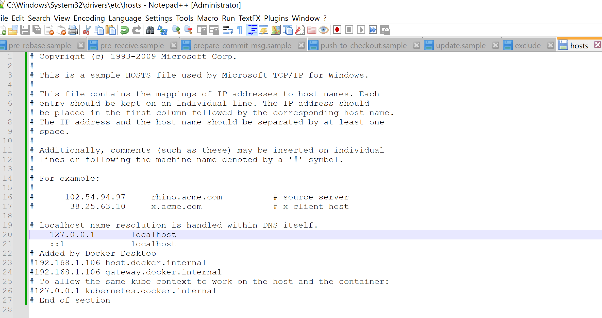

# Microservices 

This repository contains a demo project showcasing a microservices-based application, designed to provide a hands-on understanding of microservices architecture and implementation. The project consists of an API Gateway, Config Server, Discovery Server, and two microservices: Student and School.

## Getting Started 

Follow the instructions below to set up the project on your local machine for development and testing purposes.

### Prerequisites

Ensure you have the following software installed on your system before proceeding:

- Java Development Kit (JDK) 17 or later
- Maven
- Docker (optional, for containerization)

### Installation

1. Clone the repository:

2. Navigate to the project directory:
3. Build and package each component with Maven:
## Order of starting the services
1. Config Server
2. Discovery Server
3. The order of starting the rest of the services does not matter

## Project Components

### API Gateway

The API Gateway serves as the single entry point for all client requests, managing and routing them to the appropriate microservices.

### Config Server

The Config Server centralizes configuration management for all microservices, simplifying application maintenance and consistency across environments. All *.yml files are stored in one place.

### Discovery Server  Eureka Server

In essence, the Eureka Server simplifies the management of microservices in a Spring Boot environment by supporting service discovery and registration, load balancing, and health checks. It’s a crucial component in modern microservices architectures.

### check hosts mapping on your local computer

### Using OpenFeign

This project demonstrates inter-service communication using OpenFeign, a declarative REST client that simplifies service-to-service communication within the microservices ecosystem.

## Distributed Tracing

### Using Zipkin --not using that in this project

The project showcases the use of Zipkin for distributed tracing, enhancing application observability and enabling the visualization and troubleshooting of latency issues.

## Contributing

Contributions are welcome! Please read our [CONTRIBUTING.md](CONTRIBUTING.md) for details on how to contribute to this project.

## License

This project is licensed under the [MIT License](LICENSE).

## Contact

## Acknowledgements

- [OpenFeign](https://github.com/OpenFeign/feign)
- [Zipkin](https://zipkin.io/)
- [Spring Cloud Netflix](https://spring.io/projects/spring-cloud-netflix)
